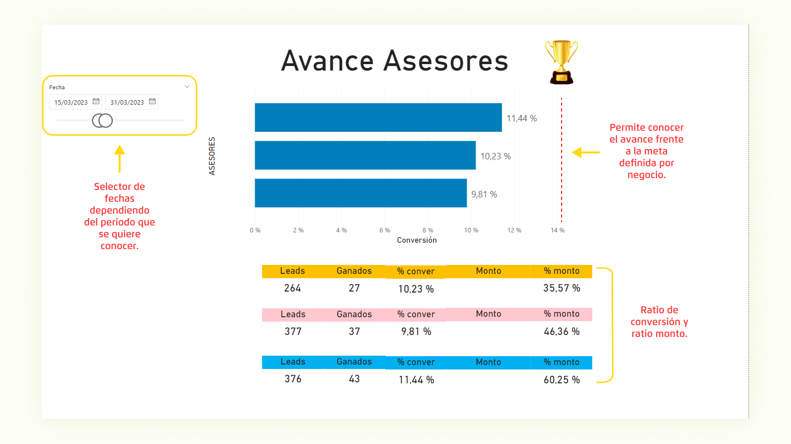

# Dashboard Avance en Ventas

## **¿Qué se hizo?** 
Se creo un dashboard usando Power Bi buscando conocer el avance en las ventas/colocaciones del producto Depósito a Plazo Fijo. Se muestra indicadores importantes para la gestión e historial de conversiones vs leads repartidos en diferentes cortes de tiempo.
## **¿Cuál fue el reto?**
Esta empresa necesitaba tener un dashboard con indicadores importantes para su gestión: ratio de conversión (leads convertidos/leads totales) y ratio de monto (monto total recaudado/monto meta). Con esta información el negocio sería capaz de tomar nuevas acciones, brindar feedback inmediato, crear nuestras estrategias y proponer nuevas formas de comunicar el producto. Toda el dataset se alojaba en un sharepoint en la nube y se debía de conectar con el dashboard para obtener rápidamente actualizaciones periódicas.
## **Preview**
[!plot](/Image/Frame 2.jpg)

)

_Nombres, datos sensibles y números han sido modificados por políticas de privacidad_
## **¿Siguientes pasos?**
Optimización para incluir nuevos asesores automáticamente, corregir errores sobre sincronización con sharepoint.
Sincronizar en tiempo real
